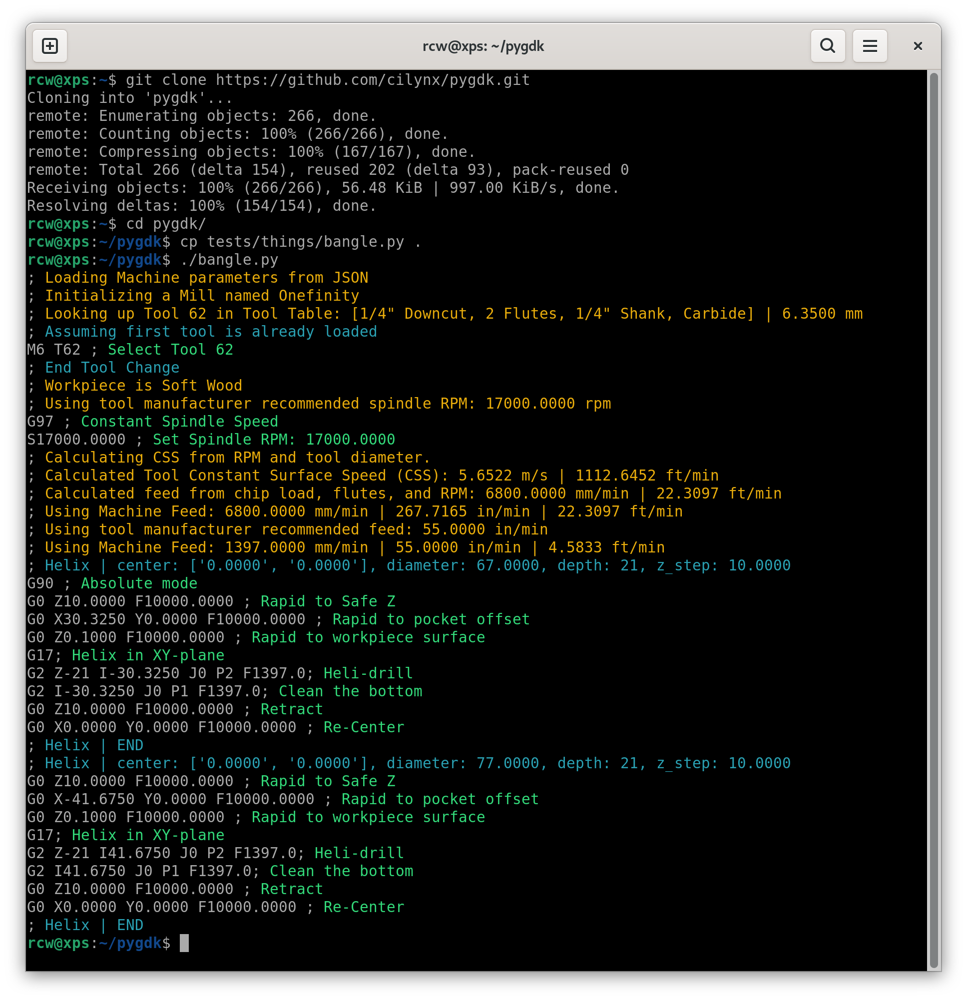
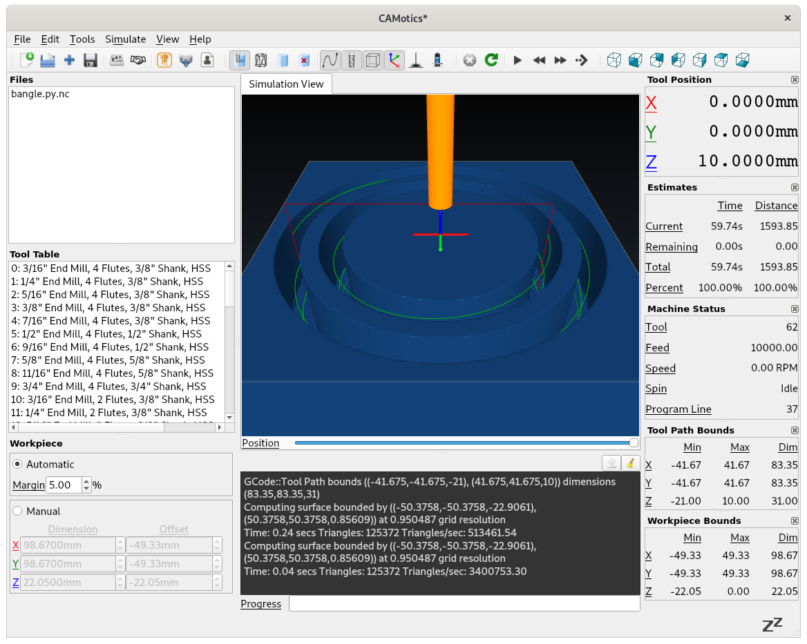

# pygdk
Python G-code Development Kit.  A library to directly generate gcode for CNC machines based directly on object features without abstract design, slicing, processing, etc.

## Disclaimer

Use this software at your own risk.  Check the gcode thoroughly before running it on your machine.  Everything you do with this software is your choice and responsibility.  I hope it ss useful, but I cannot be held responsible for injury or damage, even if it's due to errors in this software.  CNC machines are dangerous.  Be smart about it.

## Scope

This project makes a solid effort to produce generic, standard gcode that will run properly on any CNC controller.  It does not currently leverage any advanced or proprietary features/codes and if we add any of that sort of thing in the future, they'll be tied to machine profiles so they're only used when expressly configured.

That said, I am limited in platforms I can personally test.  I'm currently testing on:
* Onefinity Woodworker with the stock Onefinity-flavored Buildbotics controller
* DIY Kossel (delta) 3D-Printer running a knock-off Smoothieboard and OctoPi

If anyone is interested in providing feedback on other platforms, I'd love to hear it.

## Quickstart

Copy one of the scripts from any of the directories under `test/` to the root of this repo and run it.  It's not going to talk to your machine; it's just going to spit out gcode, so you're safe.  For this example, we're playing with [bangle.py](tests/things/bangle.py).

## Simulate

This step is technically optional, but it's good practice to simulate your gcode before you run it on your machine.  Even if you do everything right, `pygdk` is very early in development and is likely to have bugs that you can catch in simulation before anything bad happens in the real world.

Personally, I'm a fan of [CAMotics](https://camotics.org/) as it integrates with and is made by the same folks as the [buildbotics](https://buildbotics.com/) controller my Onefinity uses.

The first time you run CAMotics, you'll need to setup your tool table by right-clicking in the blank Tool Table section and selecting `Load Tool Table`.  If you don't already have a tool table you want to use, you can load in [tools.json](tools.json) -- pygdk's default tool table has more information in it than CAMotics can leverage, but it is backwards compatible.

## Execute

Once you're happy that the simulation doesn't show anything bad happening, you can copy the gcode to your machine however you would normally do it.  This might be via the machine's native web interface, a USB stick, OctoPrint, or you can even push gcode to BuildBotics controllers from inside CAMotics.

Take a deep breath, remember that you are personally responsible for everything good or bad that your machine does, then let it rip.
